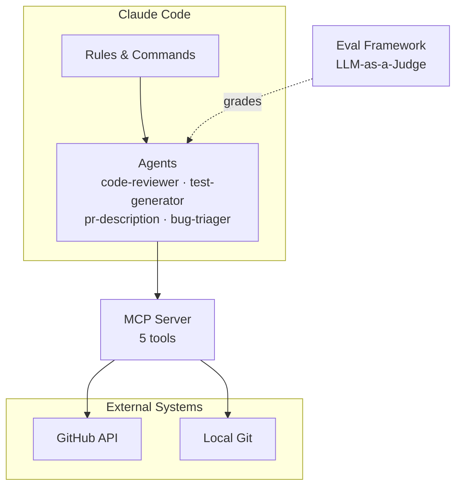

# SDLC AI Agents

[](https://www.typescriptlang.org/)
[](https://docs.anthropic.com/en/docs/claude-code)
[](LICENSE)

A collection of AI agents for common SDLC tasks, built as Claude Code configurations. Includes four agents (code review, test generation, PR descriptions, bug triage), an MCP server for GitHub/git integration, and an LLM-as-a-judge evaluation framework.

## Architecture



## Quick Start

### Prerequisites

- Node.js >= 18
- Git
- [Claude Code](https://docs.anthropic.com/en/docs/claude-code) CLI

### Installation

```bash
git clone https://github.com/dzmitrybudzko/sdlc-ai-agents.git
cd sdlc-ai-agents

# Build the MCP server
cd mcp-server && npm install && npm run build && cd ..

# Install eval dependencies
cd evals && npm install && cd ..
```

### Configure MCP Server

Add to your Claude Code MCP config (`.claude/settings.json` or global):

```json
{
  "mcpServers": {
    "sdlc": {
      "command": "node",
      "args": ["<path-to-repo>/mcp-server/dist/index.js"],
      "env": {
        "GITHUB_TOKEN": "ghp_your_token_here"
      }
    }
  }
}
```

### Use an Agent

In Claude Code, invoke an agent by name:

```
> /agent code-reviewer
> Review the staged changes for security issues
```

Or reference the agent in a conversation:

```
> @code-reviewer review the diff between main and this branch
```

## Agents

| Agent | Description | Key Capabilities |
|-------|-------------|------------------|
| **[code-reviewer](.claude/agents/code-reviewer.md)** | Reviews code for bugs, vulnerabilities, and quality issues | Structured severity levels, concrete fix suggestions, security checklist |
| **[test-generator](.claude/agents/test-generator.md)** | Generates meaningful unit and integration tests | Framework auto-detection (Vitest/Jest/Mocha), edge case coverage, typed mocks |
| **[pr-description](.claude/agents/pr-description.md)** | Generates structured PR descriptions from diffs | Explains *why* not just *what*, breaking changes detection, review notes |
| **[bug-triager](.claude/agents/bug-triager.md)** | Triages bug reports with root cause analysis | Severity classification, git blame integration, assignee recommendation |

## MCP Server

The MCP server (`mcp-server/`) provides runtime tools that agents use to interact with GitHub and local git repositories.

### Tools

| Tool | Description | Source |
|------|-------------|--------|
| `get_pr_diff` | Fetch PR diff and metadata from GitHub | GitHub API |
| `list_open_issues` | List open issues with label/assignee filtering | GitHub API |
| `get_file_blame` | Structured git blame output for a file | Local Git |
| `get_recent_contributors` | Most active contributors for a file/directory | Local Git |
| `search_codebase` | Regex search across tracked files | Local Git |

### Configuration

The server requires a `GITHUB_TOKEN` environment variable for GitHub API tools. Local git tools work without additional configuration.

Transport: **stdio** (standard for Claude Code MCP servers).

## Evaluation Framework

The eval system uses **LLM-as-a-judge** to grade agent outputs against predefined criteria and test datasets.

### How It Works

1. A test case provides input (e.g., code with a known bug) and expected findings
2. The agent processes the input and produces output
3. Claude grades the output against evaluation criteria (0-10 scale per criterion)
4. Results are aggregated across all test cases with pass/fail per criterion

### Running Evals

```bash
cd evals

# Run evals for the code-reviewer agent
npx tsx code-reviewer/run.ts

# Run using the generic framework
npx tsx framework/judge.ts --agent code-reviewer
```

Requires `ANTHROPIC_API_KEY` environment variable.

### Adding Test Cases

Add a new line to `evals/<agent-name>/dataset.jsonl`:

```json
{"input": "code with a known issue", "expected_issues": ["description of the issue"], "severity": "critical"}
```

See [evals/README.md](evals/README.md) for full documentation.

## Adding a New Agent

1. **Create the agent file**: `.claude/agents/<verb>-<noun>.md`
2. **Define the sections**:
   - Role — who the agent is
   - Allowed Tools — what it can use
   - Input — what it receives
   - Output Format — structured output template
   - Guardrails — constraints and quality rules
   - Examples — good and bad output demonstrations
3. **Create an eval dataset**: `evals/<agent-name>/dataset.jsonl`
4. **Add grading criteria**: `evals/<agent-name>/criteria.md`
5. **Test the agent** manually, then run evals to baseline quality
6. **Update this README** with the new agent in the table

## Architecture Decisions

### Why Agents over a Monolithic Tool?

Each agent has a focused role with scoped tools and tailored guardrails. A code reviewer doesn't need file-write access; a test generator doesn't need GitHub API access. Scoping reduces hallucination surface and makes each agent independently testable and evolvable.

### Why MCP for External Integrations?

MCP provides a standard protocol for tools that agents invoke at runtime. Instead of hardcoding GitHub API calls into agent prompts, we expose structured tools that any agent can discover and use. This decouples agent logic from integration details and allows the same tools to serve multiple agents.

### Why LLM-as-a-Judge for Evals?

Agent outputs are natural language with structured components — not easily graded by deterministic assertions. LLM-as-a-judge evaluates semantic correctness (did the reviewer find the SQL injection?) and quality dimensions (is the suggestion actionable?) that regex-based checks cannot capture. Each criterion has a numeric threshold, making pass/fail decisions objective and reproducible.

## Contributing

1. Fork the repository
2. Create a feature branch
3. Ensure the MCP server compiles: `cd mcp-server && npm run build`
4. If adding an agent, include an eval dataset and pass the eval suite
5. Submit a PR with a clear description of what and why

## License

MIT
